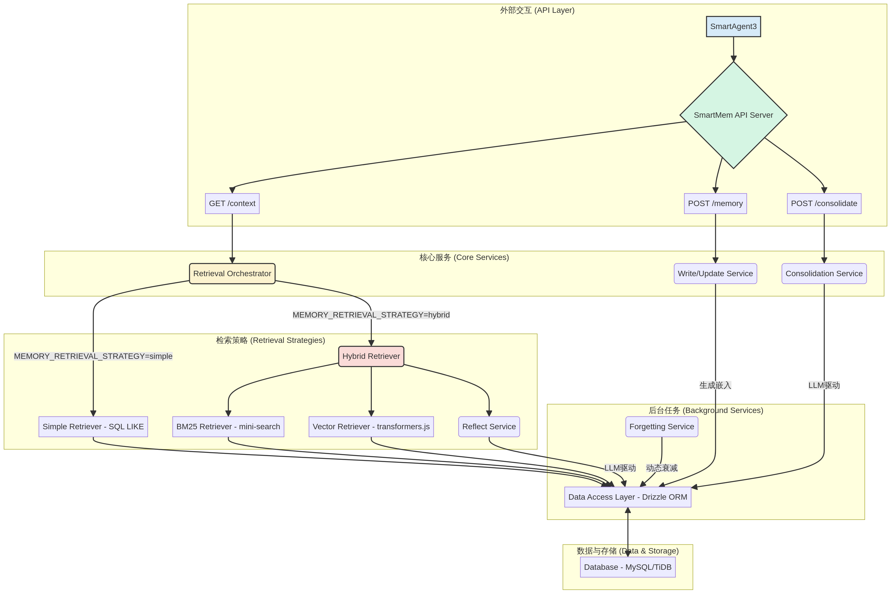

# SmartMem — 系统架构

_本文件由 system-dev 技能自动生成。_

## 1. 架构图

## 2. 模块职责

| 模块 | 技术 | 职责 |
| :--- | :--- | :--- |
| **SmartMem API 服务器** | Node.js, Express | 为 SmartAgent3 集成提供公开的 HTTP 端点。处理请求验证和路由。 |
| **检索协调器** | TypeScript | 处理读取请求 (`/context`) 的核心服务。根据 `MEMORY_RETRIEVAL_STRATEGY` 环境变量选择检索策略。 |
| **写入/更新服务** | TypeScript | 处理写入请求 (`/memory`)。负责数据验证、调用嵌入模型，并通过 DAL 将记忆持久化到数据库。 |
| **巩固服务** | TypeScript | 处理手动巩固请求 (`/consolidate`)。也可以作为计划的后台任务运行。使用 LLM 分析并创建更高阶的记忆。 |
| **遗忘服务** | TypeScript | 定期运行动态遗忘逻辑（基于重要性衰减）以修剪记忆数据库的后台服务。 |
| **简单检索器** | TypeScript, Drizzle ORM | 实现基本的 `SQL LIKE` 搜索以进行记忆检索。 |
| **混合检索器** | TypeScript | 协调高级检索过程，并行运行 BM25 和向量检索器，并合并结果。 |
| **BM25 检索器** | `mini-search` | 基于 BM25 算法执行内存中的全文搜索。 |
| **向量检索器** | `transformers.js` | 生成查询嵌入，并对数据库中（或 MVP 的内存中）的预计算向量执行余弦相似度搜索。 |
| **反思服务** | TypeScript, LangChain | (P2 功能) 获取混合检索器的合并结果，并使用 LLM 合成最终的、简洁的上下文。 |
| **数据访问层 (DAL)** | Drizzle ORM | 为所有数据库交互提供类型安全的抽象层。 |
| **数据库** | MySQL / TiDB | 所有记忆、集群和行为模式的主要数据存储。 |

## 3. 数据流描述

### 场景 A：写入新记忆

1.  **请求**：`SmartAgent3` 发送一个 `POST /memory` 请求，其中包含用户 ID 和从对话中提取的新记忆内容。
2.  **API 服务器**：接收请求并将其路由到 **写入/更新服务**。
3.  **嵌入**：该服务获取记忆内容，并（如果是新记忆）将其发送到嵌入模型 (`transformers.js`) 以生成向量。
4.  **持久化**：该服务使用记忆内容、其重要性、生成的向量和其他元数据调用 **数据访问层 (DAL)**。
5.  **数据库**：DAL 构建并执行一个 `INSERT` 查询，将新的记忆记录存储在 `memories` 表中。

### 场景 B：检索上下文（混合模式）

1.  **请求**：`SmartAgent3` 发送一个 `GET /context` 请求，其中包含用户 ID 和当前的对话查询。
2.  **API 服务器**：请求被路由到 **检索协调器**。
3.  **策略选择**：协调器检查环境变量并确定策略为 `hybrid`。
4.  **并行检索**：它调用 **混合检索器**，后者又并行运行两个检索器：
    *   **BM25 检索器**：加载内存索引并执行全文搜索。
    *   **向量检索器**：为查询生成嵌入，然后对数据库执行相似性搜索。
5.  **合并**：**混合检索器** 从两者收集结果，合并它们，并删除重复项。
6.  **反思 (P2)**：合并后的列表被传递给 **反思服务**，后者使用 LLM 生成最终的、干净的摘要。
7.  **响应**：协调器接收最终上下文（来自合并或反思的结果）并在 HTTP 响应中返回它。

## 4. 关键设计决策

| 决策 | 理由 |
| :--- | :--- |
| **可插拔的检索策略** | 使用环境变量在 `simple` 和 `hybrid` 检索之间切换，可以实现安全的部署和性能测试。默认的 `simple` 模式确保了向后兼容性和低延迟，而 `hybrid` 则可以为需要更高准确性但可以接受性能开销的用户或系统启用。 |
| **使用 TypeScript 作为核心逻辑** | 坚持使用 TypeScript 和 Node.js 确保了与现有 SmartAgent3 代码库的一致性，简化了集成和开发人员的上手过程。 |
| **MVP 采用进程内搜索** | 在初始实现中使用 `mini-search` (BM25) 和内存向量搜索 (`transformers.js`)，避免了部署和维护独立服务（如 Elasticsearch 或专用向量数据库）的运营开销。这是 MVP 的务实选择，并为系统扩展时升级到更健壮的解决方案（如 `pgvector`）提供了清晰的路径。 |
| **解耦的后台服务** | **巩固** 和 **遗忘** 服务被设计为与实时请求/响应路径解耦的后台任务。这确保了这些潜在的长时间运行、资源密集型的操作不会影响代理的感知响应速度。 |
| **为巩固功能提供手动触发器** | 除了计划执行外，提供一个 API 端点 (`/consolidate`) 来手动触发记忆巩固过程，对于调试、测试以及允许外部系统控制记忆生命周期至关重要。 |
